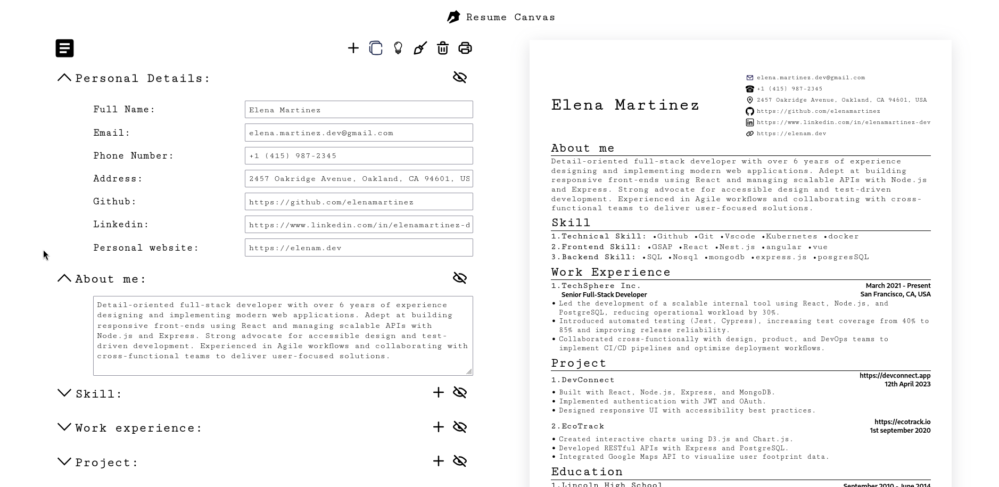

# Resume Canvas

A browser-based resume builder. Fill in your details across structured sections, see a live preview update in real time, and print or export your resume as a PDF — no account or backend required.

Live demo: https://shivanerana.github.io/Resume-Canvas/

---

## Screenshots



---

## Features

- Split-pane layout: editor on the left, live resume preview on the right
- Sections: Personal Details, About Me, Skills, Work Experience, Projects, Education, and Additional
- Each section can be individually shown or hidden on the preview
- Multiple resumes — create, copy, switch between, and delete resumes in the same session
- Clear active resume or load a pre-filled example template to get started quickly
- All resume data persists in `localStorage` and survives page refreshes
- Print support via `react-to-print`
- Deployed to GitHub Pages

---

## Tech Stack

| Category | Technology |
|---|---|
| Framework | React 19 |
| State Management | useImmer (Immer-backed useState) |
| Build Tool | Vite |
| Styling | CSS Modules |
| Print | react-to-print |
| PDF Export | html2pdf.js |
| Smooth Scroll | Lenis |
| IDs | uuid v4 |
| Deployment | GitHub Pages (`gh-pages`) |

---

## Project Structure

```
src/
├── App.jsx                  # Root component, all state and context
├── main.jsx
├── index.css
├── components/
│   ├── navbar.jsx           # Top bar with resume management controls
│   ├── editor.jsx           # Left pane — all input sections
│   ├── resume.jsx           # Right pane — live resume preview
│   ├── personalDetail.jsx   # Name, email, phone, links, address
│   ├── aboutMe.jsx          # Summary / about section
│   ├── skillDetails.jsx     # Skill groups with individual skill items
│   ├── work.jsx             # Work experience entries
│   ├── project.jsx          # Project entries with feature lists
│   ├── education.jsx        # Education entries
│   └── additional.jsx       # Custom categories (certifications, languages, etc.)
├── styles/                  # CSS Modules per component
└── assets/
    ├── images/              # SVG icons
    └── fonts/               # Self-hosted Cutive Mono
```

---

## Resume Data Shape

Each resume in the list follows this structure:

```js
{
  id: string,                  // uuid
  personalDetail: {
    fullName, email, phoneNumber,
    github, linkedIn, address, personalWebsite
  },
  aboutMe: string,
  skill: [
    { id, skillGroup, skillList: [{ id, content }] }
  ],
  work: [
    { id, company, position, startDate, endDate, address,
      list: [{ id, content }] }
  ],
  project: [
    { id, projectTitle, doc, link, summary,
      featureList: [{ id, content }] }
  ],
  education: [
    { id, name, course, major, gpa, startDate, endDate }
  ],
  additional: [
    { id, category, itemList: [{ id, content }] }
  ]
}
```

---

## Getting Started

### Prerequisites

- Node.js

### Installation

1. Clone the repository:

   ```bash
   git clone https://github.com/shivanerana/Resume-Canvas.git
   cd Resume-Canvas
   ```

2. Install dependencies:

   ```bash
   npm install
   ```

3. Start the dev server:

   ```bash
   npm run dev
   ```

   The app runs on `http://localhost:5173`.

### Other Commands

```bash
npm run build      # Production build
npm run preview    # Preview the production build locally
npm run lint       # Run ESLint
npm run pwrite     # Format all files with Prettier
npm run deploy     # Build and deploy to GitHub Pages
```

---

## Notes

- Resume data is stored in `localStorage` under the keys `list` and `activeId`
- Deleting the last resume automatically creates a blank one in its place so the app is never left in an empty state
- Section visibility (show/hide toggles) is session-only and is not persisted across refreshes
- The example template pre-populates all sections with fictional data and can be loaded at any time from the navbar
